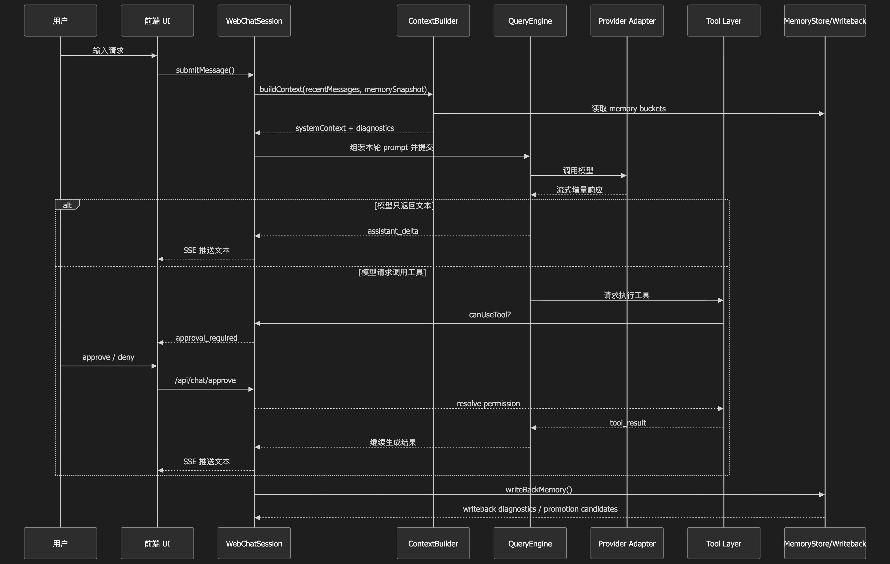
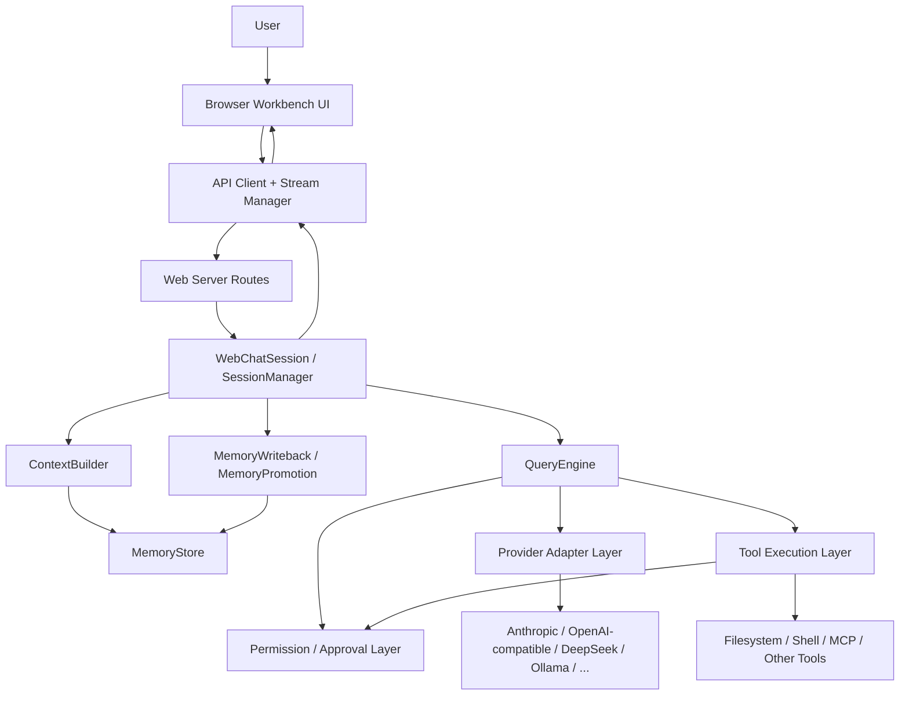

# 灵搭 · Lingda Workbench

> Turn a powerful terminal-native coding agent into a browser workbench people can actually use.

**灵搭** is a web-first adaptation of the Claude Code runtime.
If tools like **Cline** made AI coding agents more visible, Lingda pushes one step further: it tries to make them **operable, reviewable, recoverable, and easier to integrate into real engineering workflows**.

This project is built around a very practical idea:

- keep the execution power of a Claude Code–style agent runtime
- lower the usage threshold through a browser UI
- preserve human control with approval gates
- expose tools, MCP, memory, and multi-provider access in a more productized way

## Why this project matters

There is a gap between two kinds of AI dev tools:

1. **terminal-first agents** — powerful, but often too opaque or too hard to operate for non-expert users
2. **chat-style web UIs** — approachable, but too shallow to support real engineering workflows

Lingda is an attempt to bridge that gap.
It is not just “another chat page”. It is a browser workbench designed to keep the strengths of an agent runtime while making it more usable:

- **streaming sessions** instead of one-shot responses
- **approval-gated tool execution** instead of silent command running
- **session restore and hydration** instead of losing context on refresh
- **MCP configuration and management** instead of raw config files only
- **multi-provider model access** through a unified adapter layer
- **lightweight memory and context management** instead of full reset every turn

In short, this project is about turning a strong but terminal-centric AI agent into something closer to a real engineering product.

## What is inside

The current implementation is organized around these layers:

1. **Bootstrap compatibility layer**  
   Makes the original runtime work in a web/server context.

2. **Provider adapter layer**  
   Supports Anthropic plus OpenAI-compatible providers through adapter-based normalization.

3. **Session orchestration layer**  
   Web chat sessions, SSE streaming, tool approval, suspension/resume, and recovery.

4. **Frontend foundation layer**  
   API client, stream manager, shared stores, and modular React components.

5. **Memory and context layer**  
   Read-only memory snapshots, context building, diagnostics, and conservative write-back.

## Project goals

- Preserve the strengths of the original runtime
- Reduce operational complexity for end users
- Make tool use safer through explicit approval flows
- Expose core agent capabilities through a browser UI
- Keep the architecture layered and non-invasive

## Highlights at a glance

- **From terminal-only to browser workbench**: the runtime can now be operated through a structured UI instead of only through CLI flows.
- **Approval-gated execution**: high-impact actions do not silently run; they suspend, surface intent, and resume only after approval.
- **Recoverable sessions**: page refresh and reconnect scenarios are handled through session snapshots instead of resetting the workflow.
- **Provider abstraction**: Anthropic-native and OpenAI-compatible providers are normalized behind a shared execution path.
- **Lightweight memory pipeline**: context is no longer assembled by naive history dumping; it is selected, budgeted, diagnosed, and conservatively written back.

## Screenshots

### Main workbench



The current UI is organized as a browser workbench instead of a single chat window:
- left: session navigation and workspace entry points
- center: streaming conversation and approval flow
- right: project-oriented panels such as file exploration and tool-facing controls

## What you can do in practice

- inspect a codebase through a recoverable browser session instead of a disposable chat thread
- let the agent propose tool execution, then explicitly approve or reject high-impact actions
- configure providers and MCP servers without living entirely inside raw config files
- experiment with context and memory strategies instead of blindly stuffing full history into prompts
- treat the system as a controllable engineering workbench, not just a model response surface

## Typical workflow

1. start the backend and the frontend locally
2. configure a model provider in the Settings panel
3. open a session and ask the agent to inspect or modify part of the project
4. review approval prompts for tool execution when the action is sensitive
5. continue the same session with persisted state, recovery, and memory-backed context

## Validation and evidence

This project is not presented as a pure UI shell or a speculative rewrite. The current implementation was shaped through staged validation:

### End-to-end runtime validation
The core web execution path has already been validated across the following checkpoints:

- **T1** — text streaming path works end-to-end
- **T2** — tool approval, suspend, manual approve, and resume work correctly
- **T3** — session snapshot and hydration path remain readable after suspension
- **T4** — concurrent sessions remain isolated and approval IDs do not cross-contaminate
- **T5** — invalid approval requests return explicit errors without crashing the backend

### Cross-provider context benchmark
A small cross-provider benchmark was also used to compare context strategies under different providers.

From the current benchmark summary (`outputs/context-benchmark/report_cross_provider_small_v2.md`):

- On **DeepSeek**, strategies **C2** and **C3** reached the strongest balance of stability and context retention.
- On **Ollama**, the same strategies improved context hit rate, but with a larger latency trade-off.
- The takeaway is that context policy must be treated as an explicit engineering choice, not a hidden prompt concatenation side effect.

A longer engineering write-up is available in:
- [`docs/design-and-benchmarks.md`](docs/design-and-benchmarks.md)
- [`docs/zh/06-web-backend-architecture-v2.md`](docs/zh/06-web-backend-architecture-v2.md)

## Design principles

This project follows a few deliberate architectural rules:

1. **Non-invasive adaptation over core rewrite**  
   The original agent core is treated as the strongest part of the system. New capability is added through wrappers, adapters, session orchestration, and compatibility layers instead of rewriting the heart of the runtime.

2. **Make powerful behavior visible**  
   Tool execution, approval, suspension, recovery, and diagnostics are surfaced as observable product behavior rather than hidden runtime side effects.

3. **Prefer explicit degradation over silent failure**  
   Whether dealing with provider compatibility, unsupported multimodal blocks, or memory write-back, the system is designed to degrade in a visible, explainable way.

4. **Separate memory storage from context assembly**  
   Memory files are not equivalent to prompt context. Storage, selection, budgeting, diagnostics, and write-back are treated as separate responsibilities.

## Architecture at a glance



## Why this is different

### Compared with a typical web chat wrapper
- not just text-in / text-out
- supports tool execution with explicit approval
- preserves session state across interruption and restore
- treats context construction as an explicit engineering concern

### Compared with Cline-style tooling
- shares the same ambition of making agent tooling visible and operable
- pushes further on web-first session recovery, layered provider adaptation, and memory/context experimentation
- treats runtime adaptation itself as a first-class engineering problem rather than only a UI problem

## Repository guide

If you are reading this repo for the first time, start here:

- `src/server/` — web runtime, sessions, routes, and local server layer
- `src/providers/` — provider registry, adapter factory, and compatibility adapters
- `src/memory/` — memory store, context builder, write-back, and promotion logic
- `webui/src/` — browser workbench UI, stores, API client, and stream manager
- `docs/design-and-benchmarks.md` — design rationale, staged validation, and benchmark summary

## Key capabilities currently included

### Agent interaction
- streaming responses over SSE
- session snapshots and restore
- approval-required tool execution
- safe resume after approval

### Tooling and extensions
- MCP configuration panel
- MCP presets for common servers
- file tree browsing and file preview
- project-oriented quick actions

### Provider support
- Anthropic
- OpenAI-compatible
- DeepSeek
- Ollama
- Kimi
- MiniMax
- custom compatible endpoints

## Memory and context

The project includes a lightweight memory pipeline:

- `MemoryStore` for reading structured memory buckets
- `ContextBuilder` for selecting and assembling prompt context
- `MemoryWriteback` for conservative daily-summary persistence
- `MemoryPromotion` for long-term promotion candidates and diagnostics

This is intentionally lightweight and explainable rather than vector-database based.

## Prerequisites

Before running locally, prepare the following:

- **Node.js**: 18+ recommended
- **npm**: standard npm workflow is supported in this repository
- **Operating system**: macOS / Linux recommended for the current local workflow
- **Optional**: Ollama, if you want to test local models

## Quick start

### 1. Install dependencies
At the repository root:

```bash
npm install
```

Then install frontend dependencies:

```bash
cd webui
npm install
cd ..
```

### 2. Start the backend
```bash
npm run dev:server
```

Default backend URL:
```text
http://127.0.0.1:3456
```

### 3. Start the frontend
In a second terminal:

```bash
cd webui
npm run dev
```

Vite usually starts at:
```text
http://127.0.0.1:5173
```

### 4. Open the workbench
Open the frontend URL in your browser, then go to the Settings panel and configure a model provider before starting a session.

## Configuration

### Model providers
The current UI supports configuring:
- Anthropic
- OpenAI-compatible endpoints
- DeepSeek
- Ollama
- Kimi
- MiniMax
- Custom compatible endpoints

### What needs to be configured
At minimum, configure:
- provider
- model
- API key (if required)
- base URL (only if you use a custom/compatible endpoint)

Settings are written locally and then consumed by the backend runtime.

### MCP and tools
This project also includes MCP-related UI and backend routes. Depending on the provider and local environment, tool availability may differ.

## Running notes

### Backend runtime
The backend is started through:
```bash
npm run dev:server
```
This runs the local web server entrypoint and exposes session, chat, MCP, settings, and memory-related APIs.

### Frontend runtime
The frontend is a Vite-based React app under `webui/`.

### Optional local-model setup
If you want to use Ollama locally, make sure Ollama is already running before you select it from the UI.

## Current status

This repository is positioned as a working engineering prototype / research-grade implementation of a browser-based Claude Code workbench.

What is stable:
- core web session flow
- approval suspend/resume path
- provider adapter routing
- frontend workspace shell
- memory/context read pipeline
- lightweight memory write-back to daily summary

What is still evolving:
- broader provider productization
- richer MCP lifecycle management
- deeper diagnostics surfacing in UI
- further UX simplification for non-technical users
- stricter long-term memory promotion strategies

## Known limitations

- The repository is still partly shaped by an upstream research/runtime codebase, so some areas remain more engineering-heavy than product-polished.
- The root-level full build path is not the best “first success path” for new users. For local experience, use:
  - backend: `npm run dev:server`
  - frontend: `cd webui && npm run dev`
- Some provider families are exposed through adapter-based compatibility rather than fully provider-native implementations.
- MCP capability depth is improving, but not every workflow is yet as polished as mature desktop-first tools.

## Intended audience

This repository is most useful for:
- engineers exploring browser-based agent workbenches
- developers studying non-invasive runtime adaptation
- teams evaluating how to expose agent runtime capabilities safely in a GUI

## Notes

This `github-release/` directory is a cleaned packaging target prepared from a larger working directory. Temporary logs, local state, and obvious machine-specific artifacts have been excluded to make review and publication easier.

## Roadmap snapshot

Near-term areas still worth improving:
- deeper MCP lifecycle management and richer tool introspection
- broader provider productization beyond the current first-class set
- richer frontend surfacing for memory/context diagnostics
- more mature long-term memory promotion strategies

If you want the design rationale behind these directions, continue to:
- [`docs/design-and-benchmarks.md`](docs/design-and-benchmarks.md)
