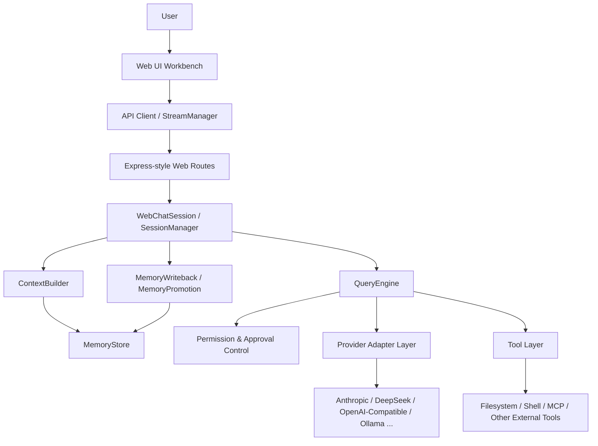
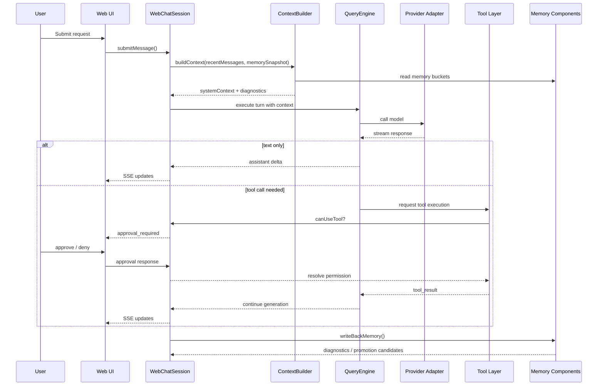

# Design and Benchmarks

This document explains the reasoning behind the current architecture and summarizes the most important validation work used to shape the project.

## 1. Problem statement

The project starts from a practical gap in current AI developer tooling:

- terminal-native agent runtimes are powerful, but operationally heavy
- browser chat shells are approachable, but often too weak for real engineering workflows

The goal here is not to build another chat wrapper. The goal is to preserve the execution power of a Claude Code–style runtime while making it significantly easier to use, reason about, and extend.

## 2. Constraints

Several design constraints shaped the implementation:

1. **Do not casually rewrite the original runtime core**  
   The core loop, tool model, and session behavior were treated as production-grade assets.

2. **Web adaptation must remain externally layered**  
   New capability should be added through adapters, session orchestration, routes, compatibility layers, and frontend structure.

3. **Failures must become diagnosable**  
   Approval behavior, provider routing, context assembly, and write-back decisions must not remain black boxes.

4. **Context must be engineered, not improvised**  
   Memory and context selection should be deliberate, budgeted, and inspectable.

## 3. System architecture overview

## 4. End-to-end interaction flow

## 5. Major architectural decisions

### 3.1 Session orchestration instead of request-only chat
A browser UI needs recoverable session state. Instead of treating each request as a stateless chat call, the project introduces a session layer to support:

- streaming lifecycle
- approval suspension and resumption
- session snapshots
- reconnect and hydration

### 3.2 Provider adapters instead of per-provider rewrites
Rather than writing a bespoke agent loop for each model vendor, the project normalizes non-Anthropic providers through an adapter layer. This allows the runtime to preserve one core interaction model while translating:

- request payload shape
- tool call structure
- streaming event form
- provider-specific compatibility rules

### 3.3 Memory storage separated from context assembly
Memory files are not directly equivalent to prompt context.
The project separates these concerns into:

- `MemoryStore` — where memory lives
- `ContextBuilder` — what enters a prompt and why
- `MemoryWriteback` — what gets written back after a turn
- `MemoryPromotion` — what may deserve long-term status later

This separation makes the system easier to debug and much safer to evolve.

## 6. Validation summary

## 4.1 End-to-end regression checks
A staged regression process was used to validate the web adaptation:

- **T1**: text streaming path works end-to-end
- **T2**: approval suspend → manual approve → resume works correctly
- **T3**: suspended session state can still be read and restored
- **T4**: concurrent sessions remain isolated
- **T5**: invalid approval paths fail explicitly without crashing the backend

These tests matter because the project depends on more than just model response quality. It depends on runtime control behavior being correct under interruption, approval, and recovery.

## 4.2 Cross-provider context benchmark
A small benchmark compared different context strategies across providers.

From `report_cross_provider_small_v2.md`:

| Strategy | Provider | OK Rate | Task Score | Context Hit Rate | Avg Latency (OK ms) |
|----------|----------|---------|------------|------------------|---------------------|
| C0 | ollama | 1.00 | 0.63 | 0.75 | 15186.75 |
| C0 | deepseek | 1.00 | 0.63 | 0.75 | 2362.13 |
| C1 | ollama | 0.75 | 0.63 | 0.75 | 16337.50 |
| C1 | deepseek | 0.88 | 0.63 | 0.88 | 1049.14 |
| C2 | ollama | 0.88 | 0.63 | 0.88 | 13785.14 |
| C2 | deepseek | 1.00 | 0.63 | 1.00 | 1975.38 |
| C3 | ollama | 0.75 | 0.63 | 0.75 | 9644.50 |
| C3 | deepseek | 1.00 | 0.75 | 0.88 | 1938.88 |

### Interpretation

- **DeepSeek** handled curated context policies much better than naive full-history stuffing.
- **Ollama** also benefited from curated context, but with a much steeper latency curve.
- Strategies **C2/C3** gave the best trade-off in this benchmark.

The architectural implication is straightforward:

> Context policy must be explicit and measurable.

That is why the project added diagnostics to the memory/context pipeline rather than hiding prompt assembly inside session code.

## 7. Memory write-back philosophy

The current write-back path is intentionally conservative.

### What it does now
- writes small, timestamped items to `daily-summary`
- deduplicates recent repeated items
- emits diagnostics and promotion candidates

### What it does not do yet
- automatically write to long-term memory
- promote items based on embedding similarity
- perform aggressive summarization

This is a deliberate decision.

The project treats memory pollution as a more dangerous failure mode than under-recording. In other words:

> it is better to remember too little than to remember the wrong thing everywhere.

## 8. Current limitations

This is still an engineering prototype, not a finished product.

Key limitations include:

- some provider integrations are productized less deeply than others
- MCP lifecycle management is still evolving
- diagnostics are richer on the backend than in the UI today
- full root-level build remains less reliable than the recommended local dev path
- memory promotion is currently candidate-only, not fully operationalized

## 9. Why this project is worth studying

This repository is useful not because it is a perfect end product, but because it demonstrates a realistic engineering approach to a hard problem:

- adapt a strong but terminal-centric agent runtime
- preserve the original strengths
- expose control surfaces in the browser
- make context and memory observable
- improve usability without erasing capability

In that sense, this project is best understood as:

> a browser-first engineering workbench built around an agent runtime, with explicit attention to safety, recoverability, and context discipline.
